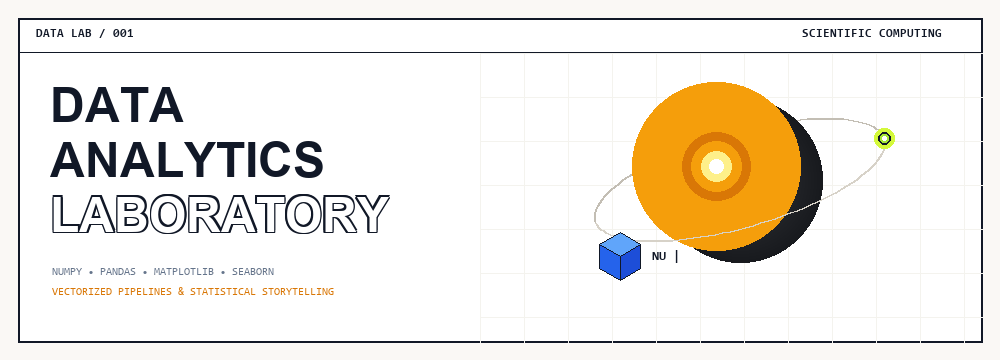
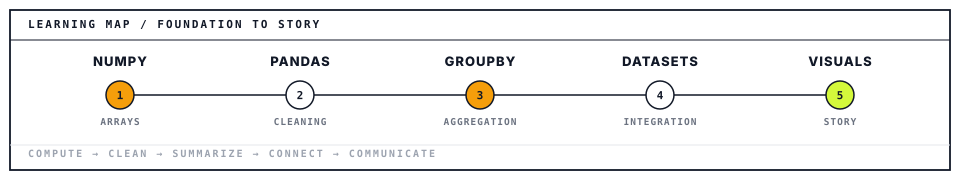
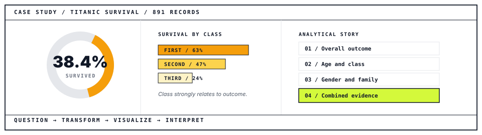

<div align="center">

```
REPOSITORY DESIGN / 001                                       DATA ANALYTICS LABORATORY
```



<br/><br/>

# DATA ANALYTICS
# 𝚁𝙴𝙿𝙾𝚂𝙸𝚃𝙾𝚁𝚈

### A structured learning laboratory for scientific computing, data wrangling, visualization, and evidence-based analytical storytelling.

<br/>

<table align="center" width="100%">
<tr>
<td bgcolor="#D4F93B" style="background-color: #D4F93B; padding: 18px 24px; border: 2px solid #111827; border-radius: 4px;">
<div style="color: #111827; font-family: -apple-system, BlinkMacSystemFont, 'Segoe UI', Roboto, sans-serif;">
<strong style="font-size: 11px; letter-spacing: 2px; text-transform: uppercase; font-family: monospace;">REPOSITORY</strong><br/>
<span style="font-size: 20px; font-weight: 800; font-family: monospace;"><a href="https://github.com/24pwai0015-max/data-analytics" style="color: #111827; text-decoration: none;">24pwai0015-max/data-analytics</a></span><br/>
<span style="font-size: 13px; font-weight: 600; color: #1F2937;">NumPy · Pandas · Matplotlib · Seaborn · Exploratory analysis</span>
</div>
</td>
</tr>
</table>

<br/>

<!-- Repository Highlights Stats -->


<br/>

```
PUBLIC LEARNING RECORD                                                              01
```

</div>

---

<br/>

```
PURPOSE AND METHOD                                                              02 / 05
```

## FROM RAW DATA TO CLEAR EVIDENCE

> **Each module pairs a technical concept with executable Python work, notes, and applied datasets.**

<br/>

| 01 <br/> **NumPy** | 02 <br/> **Pandas** | 03 <br/> **Matplotlib** | 04 <br/> **Seaborn** |
| :--- | :--- | :--- | :--- |
| Arrays, broadcasting, masking, aggregation. | Cleaning, grouping, joins, pivots. | Canvas control and figure architecture. | Statistical plots and relationships. |

<br/>

### Data Pipeline & Five-Stage Method

<div align="center">
  
</div>

<br/>

| # | Operating Principle | Architectural Guideline |
| :---: | :--- | :--- |
| **01** | **Inspect structure & data quality before analysis** | Verify schemas, missingness vectors, and descriptive summary statistics before modeling. |
| **02** | **Prefer vectorized, reproducible transformations** | Eliminate iterative loops; maximize NumPy broadcasting and vectorized Pandas operations. |
| **03** | **Choose plots according to the analytical question** | Match distribution, categorical, and correlation questions to specialized plot canvases. |
| **04** | **Separate evidence from interpretation** | Present verifiable statistical charts first, followed by clear narrative deduction. |

<br/>

```
REPOSITORY PURPOSE                                                                  02
```

---

<br/>

```
CURRICULUM                                                                      03 / 05
```

## FIVE-WEEK LEARNING ARCHITECTURE

<div align="center">
  
</div>

<br/>

### Core Curriculum Roadmap

| Stage | Focus Area | Demonstrated Capability |
| :--- | :--- | :--- |
| **Week 1** | **NumPy Foundations** | Reshape, slice, broadcast, filter, aggregate, sample. |
| **Week 2** | **Selection & Cleaning** | Use Series, DataFrames, `loc`, `iloc`, strings, and missing-value strategies. |
| **Week 3** | **Aggregation & Pivots** | Apply split-apply-combine, multi-metric summaries, and contingency analysis. |
| **Week 4** | **Integration & Datasets** | Join tables, engineer features, and perform end-to-end exploration. |
| **Week 5** | **Visualization Architecture** | Build multi-panel figures and a complete analytical narrative. |

<br/>

<table width="100%">
<tr>
<td width="50%" valign="top" style="padding: 16px; border: 1.5px solid #111827; background-color: #FFFFFF;">
<span style="background-color: #F59E0B; color: #111827; padding: 2px 8px; font-size: 11px; font-weight: 700; font-family: monospace;">Foundation</span>
<h4>Compute correctly</h4>
<p style="font-size: 13px; color: #4B5563; margin-bottom: 0;">Understand shapes, axes, types, indexing, and vectorized transformations.</p>
</td>
<td width="50%" valign="top" style="padding: 16px; border: 1.5px solid #111827; background-color: #FFFFFF;">
<span style="background-color: #F59E0B; color: #111827; padding: 2px 8px; font-size: 11px; font-weight: 700; font-family: monospace;">Communication</span>
<h4>Explain responsibly</h4>
<p style="font-size: 13px; color: #4B5563; margin-bottom: 0;">Make visual claims that remain traceable to code and data.</p>
</td>
</tr>
</table>

<br/>

<details>
<summary><strong>🔍 Browse Complete Laboratory Directory &amp; Scripts (Weeks 1 to 5)</strong></summary>

<br/>

#### Week 1 — NumPy Foundations & Vectorized Computing
Mastering multidimensional arrays, memory layout, and vectorized computation without slow Python loops.

| Lab / File | Focus Area | Core Concepts Demonstrated |
| :--- | :--- | :--- |
| [`w1_01_arrays_reshape_slicing.py`](numpy/w1_01_arrays_reshape_slicing.py) | Array Fundamentals | Dimensional reshaping, n-dim slicing, strided access |
| [`w1_02_broadcasting.py`](numpy/w1_02_broadcasting.py) | Tensor Broadcasting | Dimension expansion, compatible shape rules, matrix ops |
| [`w1_03_bolean_masking.py`](numpy/w1_03_bolean_masking.py) | Masking & Filtering | Vectorized conditional indexing, boolean combinations |
| [`w1_04_aggregations..py`](numpy/w1_04_aggregations..py) | Reductions & Stats | `np.sum`, `np.mean`, `axis=0/1` statistical reductions |
| [`w1_05_random_tasks.py`](numpy/w1_05_random_tasks.py) | Stochastic Engines | Seeded distributions, random permutations, sampling |
| [`w1_numpy_mini_project.py`](numpy/w1_numpy_mini_project.py) | Integrated Capstone | Vectorized multi-step computational pipeline |

---

#### Weeks 2 to 4 — Pandas Wrangling & Feature Engineering
Transforming messy, incomplete real-world tables into clean, structured analytic dataframes.

| Module | Core Files | Key Techniques |
| :--- | :--- | :--- |
| **Week 2: Series & Cleaning** | [`w2_01_Series_DataFrame.py`](pandas/w2_01_Series_DataFrame.py)<br/>[`w2_02_loc_iloc.py`](pandas/w2_02_loc_iloc.py)<br/>[`w2_03_missing_values.py`](pandas/w2_03_missing_values.py)<br/>[`w2_05_strings.py`](pandas/w2_05_strings.py) | • `.loc` vs `.iloc` selection semantics<br/>• Missing data strategies (`fillna`, `dropna`, mean/mode)<br/>• Vectorized string manipulation & Regex extraction |
| **Week 3: Aggregations & Pivot** | [`w3_01_apply_lambda.py`](pandas/w3_01_apply_lambda.py)<br/>[`w3_02_groupby_basics.py`](pandas/w3_02_groupby_basics.py)<br/>[`w3_03_groupby_agg.py`](pandas/w3_03_groupby_agg.py)<br/>[`w3_04_pivote_tables.py`](pandas/w3_04_pivote_tables.py)<br/>[`w3_05_value_counts_crosstab.py`](pandas/w3_05_value_counts_crosstab.py) | • Split-Apply-Combine paradigms (`groupby`)<br/>• Multi-metric aggregations (`.agg(['mean', 'std'])`)<br/>• Pivot tables and two-way contingency matrices (`crosstab`) |
| **Week 4: Joins & Wine Dataset** | [`w4_01_merge_concat_01.py`](pandas/w4_01_merge_concat_01.py)<br/>[`w4_02_wine_quality_dataset.py`](pandas/w4_02_wine_quality_dataset.py)<br/>[`titanic_eda.py`](pandas/titanic_eda.py) | • SQL-style relational joins (inner, outer, left, right)<br/>• Wine Quality physicochemical correlation matrix<br/>• End-to-end dataset wrangling |

---

#### Week 5 — Visualization Architecture (Matplotlib & Seaborn)
Transforming statistical distributions and categorical relationships into high-impact visuals.

```
Matplotlib-Seaborn/week-5/
├── day-1/  ── Matplotlib Foundations (line plots, pie charts, custom labels)
├── day-2/  ── Plot Styling, Color Palettes, and Precision Grid Control
├── day-3/  ── Multi-Axis Subplot Architecture & Figure Canvas Geometry
├── day-4/  ── Seaborn Statistical Distributions, Categorical & Count Plots
├── day-5/  ── Integrated Pandas-to-Matplotlib Plotting Workflows
└── day-6/  ── Complete 9-Part Titanic Visual Story & Narrative Exploration
```

| Day | Key Scripts & Documentation | Highlights |
| :---: | :--- | :--- |
| **Day 1** | [`w5_01_matplotlib_basics.py`](Matplotlib-Seaborn/week-5/day-1/w5_01_matplotlib_basics.py) • [`01_notes.md`](Matplotlib-Seaborn/week-5/day-1/01_notes.md) | Single & multiple curves, title/legend typography, pie charts |
| **Day 2** | [`w5_02_customizing_plots.py`](Matplotlib-Seaborn/week-5/day-2/w5_02_customizing_plots.py) • [`w5_02_gridLines.py`](Matplotlib-Seaborn/week-5/day-2/w5_02_gridLines.py) | Alpha transparency, custom marker aesthetics, dual axes |
| **Day 3** | [`subplots.py`](Matplotlib-Seaborn/week-5/day-3/subplots.py) • [`tasks.py`](Matplotlib-Seaborn/week-5/day-3/tasks.py) | 2x3 grid arrays, shared axes, figure layout geometry |
| **Day 4** | [`w5_04_seaborn_basics.py`](Matplotlib-Seaborn/week-5/day-4/w5_04_seaborn_basics.py) • [`notes.md`](Matplotlib-Seaborn/week-5/day-4/notes.md) | Statistical estimation, confidence intervals, `hue` semantics |
| **Day 5** | [`w5_05_pandas_matplotlib.py`](Matplotlib-Seaborn/week-5/day-5/w5_05_pandas_matplotlib.py) • [`notes.md`](Matplotlib-Seaborn/week-5/day-5/notes.md) | Native `.plot()` integration, cross-tab visualizations |
| **Day 6** | [`w5_sunday_titanic_visual_story.py`](Matplotlib-Seaborn/week-5/day-6/w5_sunday_titanic_visual_story.py) | Complete 9-Part Titanic Visual Story dashboards |

</details>

<br/>

```
LEARNING ARCHITECTURE                                                               03
```

---

<br/>

```
FEATURED ANALYSIS                                                               04 / 05
```

## TITANIC SURVIVAL VISUAL STORY

> **Nine linked analytical questions transform 891 passenger records into a clear demographic and socioeconomic narrative.**

<br/>

<div align="center">
  
</div>

<br/>

<div align="center">
  
</div>

<br/>

### Analytical Findings & Visual Methods

| Question | Method | Finding |
| :--- | :--- | :--- |
| **Overall outcome** | Pie chart | **Approximately 38.4% survived** (342 passengers) vs **61.6% deceased** (549 passengers). |
| **Passenger class** | Bar plot | **Survival decreases strictly from first to third class** (1st: 63% > 2nd: 47% > 3rd: 24%). |
| **Gender** | Count plot with hue | **Female survival substantially exceeds male survival** (~74.2% female vs ~18.9% male). |
| **Family size** | Engineered feature | **Small families (2–4 members) outperform** solo travelers and large families (5+). |
| **Class and gender** | Pivot heatmap | **First-class women form the highest-survival cohort** (~96.8%), while 3rd-class males dropped to ~13.5%. |
| **Age distribution** | Stacked histplot | Highest demographic mortality occurred among young adult males aged 18–35. |
| **Fare distribution** | Grouped boxplot | Disproportionately higher fares in 1st class (up to £512) directly correlated with survival access. |
| **Embarkation port** | Categorical breakdown | Southampton (S: ~72%) boarded majority; Cherbourg (C) passengers exhibited highest survival proportion. |

<br/>

```
APPLIED EXPLORATORY ANALYSIS                                                        04
```

---

<br/>

```
QUICKSTART                                                                      05 / 05
```

## CLONE. INSTALL. RUN THE ANALYSIS.

<br/>

<table width="100%">
<tr>
<td bgcolor="#FFFFFF" style="border: 2px solid #111827; padding: 18px 24px;">
<span style="background-color: #F59E0B; color: #111827; padding: 2px 10px; font-size: 11px; font-weight: 700; font-family: monospace;">Windows PowerShell</span>
<br/><br/>

```powershell
git clone https://github.com/24pwai0015-max/data-analytics.git
cd data-analytics
python -m venv venv
Set-ExecutionPolicy -Scope Process -ExecutionPolicy Bypass
& ".\venv\Scripts\Activate.ps1"
python -m pip install --upgrade pip
pip install -r requirements.txt
```

<strong style="font-size: 12px; letter-spacing: 1px; font-family: monospace;">Run the featured visual story</strong>

```powershell
python Matplotlib-Seaborn\week-5\day-6\w5_sunday_titanic_visual_story.py
```

</td>
</tr>
</table>

<br/>

<table width="100%">
<tr>
<td width="50%" valign="top" style="padding: 16px; border: 1.5px solid #111827; background-color: #FFFFFF;">
<strong style="font-family: monospace; font-size: 13px;">Repository structure</strong>

```
data-analytics/
├── numpy/
├── pandas/
├── Matplotlib-Seaborn/
├── assets/
├── requirements.txt
└── README.md
```
</td>
<td width="50%" valign="top" style="padding: 16px; border: 1.5px solid #111827; background-color: #FFFFFF;">
<strong style="font-family: monospace; font-size: 13px;">Learning direction</strong><br/><br/>
<strong>01</strong> &nbsp; Scientific computing<br/>
<strong>02</strong> &nbsp; Data transformation<br/>
<strong>03</strong> &nbsp; Exploratory analysis<br/>
<strong>04</strong> &nbsp; AI-assisted automation
</td>
</tr>
</table>

<br/>

<table width="100%">
<tr>
<td bgcolor="#D4F93B" style="background-color: #D4F93B; padding: 14px 20px; border: 1.8px solid #111827;">
<strong style="color: #111827; font-size: 12px; font-family: monospace;">Design note:</strong> <span style="color: #111827; font-size: 12px;">The GitHub version uses an animated local GIF. This PDF uses a static frame for reliable document rendering.</span>
</td>
</tr>
</table>

<br/>

<div align="center">

```
READY TO USE                                                                        05
```

</div>
