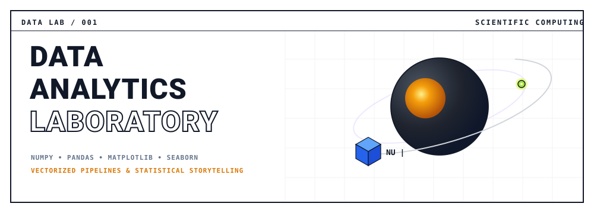
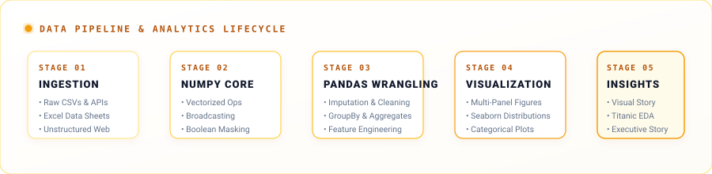

<div align="center">

  

  <br/><br/>

  <a href="https://git.io/typing-svg">
    
  </a>

  <br/>

  <!-- Badges -->
  <p align="center">
    
    
    
    
    
    
  </p>

</div>

---

<div align="center">
  
</div>

<br/>

> **Welcome to the Data Analytics & Scientific Computing Laboratory.**  
> A high-voltage, production-oriented repository engineered to bridge raw tabular data, vectorized matrix algebra, robust data cleaning pipelines, and publication-ready visual storytelling.

---

## ⚡ Data Pipeline & Architecture

<div align="center">
  
</div>

The architecture decomposes full-cycle exploratory analysis into five interconnected execution stages:


---

## 🎨 Visual Showcase & Exploratory Case Studies

### 🚢 The Titanic Visual Story (`Week 5 / Day 6`)
A comprehensive, end-to-end demographic and survival analysis extracted from the historical Titanic passenger manifest.

<div align="center">
  
</div>

<br/>

#### 🔍 Key Analytic Takeaways
| Feature Dimension | Key Metric / Pattern | Analytical Significance |
| :--- | :--- | :--- |
| **Gender Disparity** | **74.2% Female** vs **18.9% Male** survival | Massive empirical evidence of maritime protocol (*"Women and children first"*). |
| **Socioeconomic Class** | **Class 1 (63%)** > **Class 2 (47%)** > **Class 3 (24%)** | Proximity to boat decks and socioeconomic hierarchy heavily dictated survival odds. |
| **Family Dynamics** | `family_size = horizontal + vertical + 1` | Small families (2–4 members) had highest survival; solo passengers and large families suffered high mortality. |
| **Age Demographics** | Binned `pd.cut` (Child, Teen, Young Adult, Adult, Senior) | Children under 12 exhibited high survival rescue priority across all passenger classes. |

---

## 🗺️ Syllabus & Laboratory Directory

### 🔹 Week 1 — NumPy Foundations & Vectorized Computing
Mastering multidimensional arrays, memory layout, and vectorized computation without slow Python loops.

| Lab / File | Focus Area | Core Concepts Demonstrated |
| :--- | :--- | :--- |
| [`w1_01_arrays_reshape_slicing.py`](numpy/w1_01_arrays_reshape_slicing.py) | Array Fundamentals | Dimensional reshaping, n-dim slicing, strided access |
| [`w1_02_broadcasting.py`](numpy/w1_02_broadcasting.py) | Tensor Broadcasting | Dimension expansion, compatible shape rules, matrix ops |
| [`w1_03_bolean_masking.py`](numpy/w1_03_bolean_masking.py) | Masking & Filtering | Vectorized conditional indexing, boolean combinations |
| [`w1_04_aggregations..py`](numpy/w1_04_aggregations..py) | Reductions & Stats | `np.sum`, `np.mean`, `axis=0/1` statistical reductions |
| [`w1_05_random_tasks.py`](numpy/w1_05_random_tasks.py) | Stochastic Engines | Seeded distributions, random permutations, sampling |
| [`w1_numpy_mini_project.py`](numpy/w1_numpy_mini_project.py) | Integrated Capstone | Vectorized multi-step computational pipeline |

---

### 🔹 Weeks 2 to 4 — Pandas Wrangling & Feature Engineering
Transforming messy, incomplete real-world tables into clean, structured analytic dataframes.

| Module | Core Files | Key Techniques |
| :--- | :--- | :--- |
| **Week 2: Series & Cleaning** | [`w2_01_Series_DataFrame.py`](pandas/w2_01_Series_DataFrame.py)<br/>[`w2_02_loc_iloc.py`](pandas/w2_02_loc_iloc.py)<br/>[`w2_03_missing_values.py`](pandas/w2_03_missing_values.py)<br/>[`w2_05_strings.py`](pandas/w2_05_strings.py) | • `.loc` vs `.iloc` selection semantics<br/>• Missing data strategies (`fillna`, `dropna`, mean/mode)<br/>• Vectorized string manipulation & Regex extraction |
| **Week 3: Aggregations & Pivot** | [`w3_01_apply_lambda.py`](pandas/w3_01_apply_lambda.py)<br/>[`w3_02_groupby_basics.py`](pandas/w3_02_groupby_basics.py)<br/>[`w3_03_groupby_agg.py`](pandas/w3_03_groupby_agg.py)<br/>[`w3_04_pivote_tables.py`](pandas/w3_04_pivote_tables.py)<br/>[`w3_05_value_counts_crosstab.py`](pandas/w3_05_value_counts_crosstab.py) | • Split-Apply-Combine paradigms (`groupby`)<br/>• Multi-metric aggregations (`.agg(['mean', 'std'])`)<br/>• Pivot tables and two-way contingency matrices (`crosstab`) |
| **Week 4: Joins & Wine Dataset** | [`w4_01_merge_concat_01.py`](pandas/w4_01_merge_concat_01.py)<br/>[`w4_02_wine_quality_dataset.py`](pandas/w4_02_wine_quality_dataset.py)<br/>[`titanic_eda.py`](pandas/titanic_eda.py) | • SQL-style relational joins (inner, outer, left, right)<br/>• Wine Quality physicochemical correlation matrix<br/>• End-to-end dataset wrangling |

---

### 🔹 Week 5 — Visualization Architecture (Matplotlib & Seaborn)
Transforming statistical distributions and categorical relationships into high-impact visuals.

```
Matplotlib-Seaborn/week-5/
├── day-1/  ── Matplotlib Foundations (line plots, pie charts, custom labels)
├── day-2/  ── Plot Styling, Color Palettes, and Precision Grid Control
├── day-3/  ── Multi-Axis Subplot Architecture & Figure Canvas Geometry
├── day-4/  ── Seaborn Statistical Distributions, Categorical & Count Plots
├── day-5/  ── Integrated Pandas-to-Matplotlib Plotting Workflows
└── day-6/  ── Titanic Visual Story: Feature Engineering & Demographic Narrative
```

| Day | Key Scripts & Documentation | Highlights |
| :---: | :--- | :--- |
| **Day 1** | [`w5_01_matplotlib_basics.py`](Matplotlib-Seaborn/week-5/day-1/w5_01_matplotlib_basics.py) • [`01_notes.md`](Matplotlib-Seaborn/week-5/day-1/01_notes.md) | Single & multiple curves, title/legend typography, pie charts |
| **Day 2** | [`w5_02_customizing_plots.py`](Matplotlib-Seaborn/week-5/day-2/w5_02_customizing_plots.py) • [`w5_02_gridLines.py`](Matplotlib-Seaborn/week-5/day-2/w5_02_gridLines.py) | Alpha transparency, custom marker aesthetics, dual axes |
| **Day 3** | [`subplots.py`](Matplotlib-Seaborn/week-5/day-3/subplots.py) • [`tasks.py`](Matplotlib-Seaborn/week-5/day-3/tasks.py) | $2\times 3$ grid arrays, shared axes, figure layout geometry |
| **Day 4** | [`w5_04_seaborn_basics.py`](Matplotlib-Seaborn/week-5/day-4/w5_04_seaborn_basics.py) • [`notes.md`](Matplotlib-Seaborn/week-5/day-4/notes.md) | Statistical estimation, confidence intervals, `hue` semantics |
| **Day 5** | [`w5_05_pandas_matplotlib.py`](Matplotlib-Seaborn/week-5/day-5/w5_05_pandas_matplotlib.py) • [`notes.md`](Matplotlib-Seaborn/week-5/day-5/notes.md) | Native `.plot()` integration, cross-tab visualizations |
| **Day 6** | [`w5_sunday_titanic_visual_story.py`](Matplotlib-Seaborn/week-5/day-6/w5_sunday_titanic_visual_story.py) | 🚢 **Titanic Story:** `family_size`, title grouping, age bins, survival rates |

---

## 🚀 Quickstart & Environment Setup

### 1. Clone the Repository
```bash
git clone https://github.com/24pwai0015-max/data-analytics.git
cd data-analytics
```

### 2. Activate the Unified Virtual Environment

#### 🔷 Windows PowerShell (Recommended)
```powershell
Set-ExecutionPolicy -Scope Process -ExecutionPolicy Bypass
& ".\venv\Scripts\Activate.ps1"
```

#### 🔷 Windows Command Prompt (cmd)
```cmd
venv\Scripts\activate.bat
```

#### 🔷 macOS / Linux / Git Bash
```bash
source venv/Scripts/activate
```

### 3. Install Dependencies
```bash
pip install -r requirements.txt
```

### 4. Run the Featured Titanic Visual Story
```powershell
python Matplotlib-Seaborn\week-5\day-6\w5_sunday_titanic_visual_story.py
```

---

<div align="center">
  <sub>Engineered with ⚡ for high-performance data analytics and AI agent automation.</sub>
</div>
